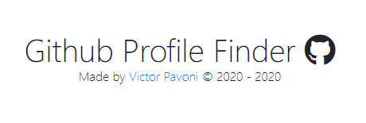
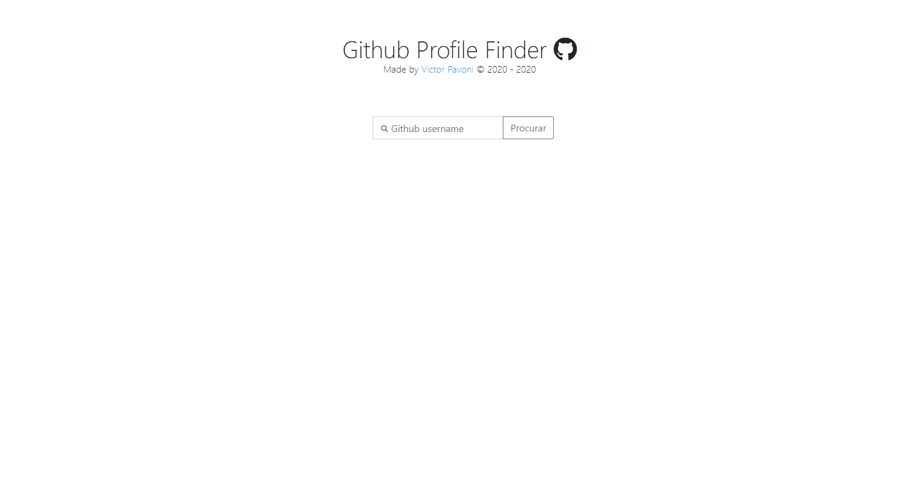

# 
Github Profile Finder :octocat:

# 

O <strong>Github Profile Finder</strong> foi feito com o intuito de aprender mais sobre a linguagem ES6 e ajudar pessoas a encontrarem perfis no github de forma mais rapida e facil.

# 

# 
🚀 Tecnologias

O projeto foi desenvolvido nas seguintes tecnologias:

* 
✔️ BootStrap V4.5

* 
✔️ HTML

* 
✔️ CSS

* 
✔️ JavaScript

Feito por <strong>Victor Pavoni</strong> 👋 [Visite o projeto clicando aqui.](https://www.ghpf.netlify.com)
